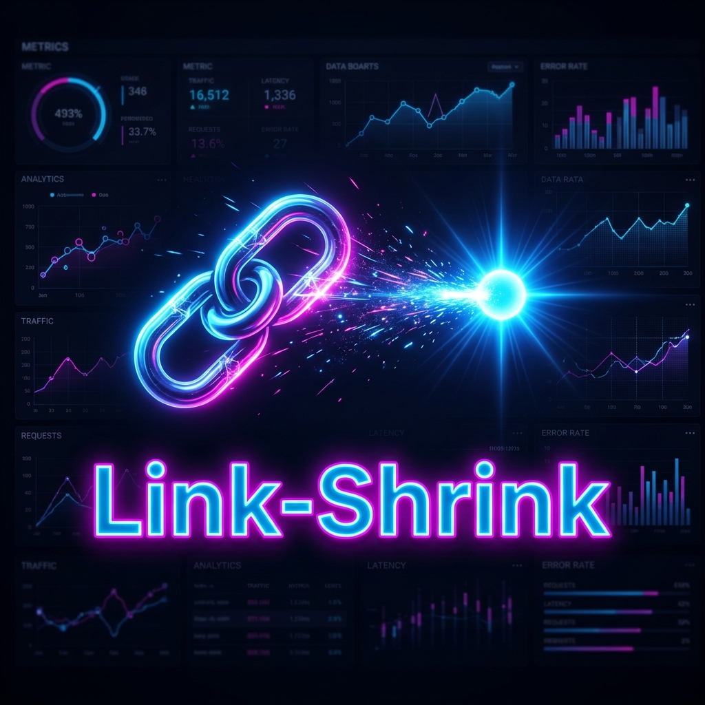
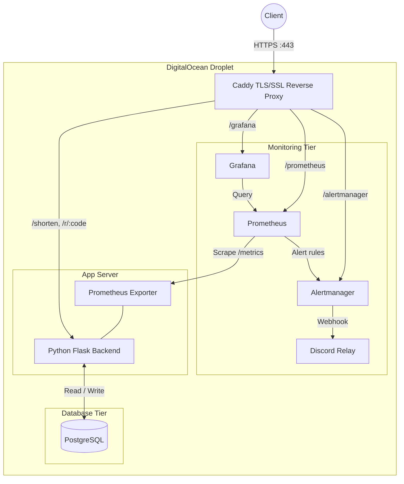

<div align="center">

  

  <h1>🔗 Link-Shrink</h1>
  <p><strong>Production-grade URL Shortener</strong> with end-to-end TLS encryption, full-stack observability, and automated incident response. Built for the MLH Production Engineering Hackathon 2026.</p>

  <a href="https://link-shrink.duckdns.org">
    
  </a>
  <a href="https://github.com/Shreyp087/PE-Hackathon-Template-2026/actions/workflows/ci.yml">
    
  </a>
  <br><br>

  > **Judges / Reviewers:** 👉 **[Test the live application here](https://link-shrink.duckdns.org)** 👈

</div>

---

## ✨ Features at a Glance

- **🔒 End-to-End Encrypted:** Automatic TLS/SSL via Caddy reverse proxy — zero manual certificate management.
- **👁️ Full Observability:** Prometheus metrics, Grafana dashboards, structured JSON logs — all accessible from the browser.
- **🚨 Automated Alerts:** 4 alert rules fire to Discord within 2 minutes of failure detection.
- **📖 Operator-Ready:** Complete Runbook, Post-Incident Report, and deployment documentation.
- **🧪 CI Tested:** Smoke tests run on every push — `/health`, `/metrics`, `/system`, and JSON log validation.
- **☁️ Cloud Deployed:** Live on DigitalOcean with secure HTTPS at [link-shrink.duckdns.org](https://link-shrink.duckdns.org).

---

## 🏗️ Architecture



> All observability tools are securely routed through Caddy subpaths — no exposed ports.

---

## 🚀 Quick Start

Get Link-Shrink running in 30 seconds:

```bash
git clone https://github.com/Shreyp087/PE-Hackathon-Template-2026.git && cd PE-Hackathon-Template-2026
docker compose up -d --build
```

> [!NOTE]
> Visit **[https://link-shrink.duckdns.org](https://link-shrink.duckdns.org)** to access the live deployment.
> **Grafana:** [/grafana](https://link-shrink.duckdns.org/grafana) &nbsp;|&nbsp; **Prometheus:** [/prometheus](https://link-shrink.duckdns.org/prometheus) &nbsp;|&nbsp; **Alertmanager:** [/alertmanager](https://link-shrink.duckdns.org/alertmanager)

---

## 📚 Documentation

<details>
<summary><b>👨‍💻 For Developers</b></summary>

Understand the codebase and start contributing:
1. [Documentation Index](docs/INDEX.md) — Full orientation
2. [Architecture Guide](docs/ARCHITECTURE.md) — System design deep dive
3. [API Reference](docs/API.md) — All endpoints documented
4. [Local Dev Setup](#%EF%B8%8F-manual-development-setup) — Environment configuration

</details>

<details>
<summary><b>🛠️ For DevOps / SRE</b></summary>

Operational guidance for production:
1. [Deployment Guide](docs/DEPLOY.md) — Local to DigitalOcean
2. [Config Reference](docs/CONFIG.md) — Environment variable tuning
3. [Capacity Plan](docs/CAPACITY.md) — Scaling limits and baselines
4. [Troubleshooting](docs/TROUBLESHOOTING.md) — Common fixes

</details>

<details>
<summary><b>🚨 For On-Call Engineers</b></summary>

Fast response when things break:
1. [Incident Runbook](RUNBOOK.md) — Step-by-step alert playbooks
2. [Post-Incident Report](POST_INCIDENT_REPORT.md) — Past incident analysis
3. [Troubleshooting Guide](docs/TROUBLESHOOTING.md) — Root cause diagnosis

</details>

<details>
<summary><b>📑 Complete Documentation Index</b></summary>

| Document | Audience | Purpose |
| :--- | :--- | :--- |
| [Architecture](docs/ARCHITECTURE.md) | Engineers | System design & data flow |
| [API Reference](docs/API.md) | Developers | Endpoint documentation |
| [Deployment](docs/DEPLOY.md) | SRE | Production deployment guide |
| [Runbook](RUNBOOK.md) | On-Call | Incident response playbooks |
| [Troubleshooting](docs/TROUBLESHOOTING.md) | On-Call | Diagnostic procedures |
| [Decisions](docs/DECISIONS.md) | Architects | ADR decision log |
| [Simulation](docs/SIMULATION.md) | QA / SRE | Load & failure testing |
| [Config](docs/CONFIG.md) | DevOps | Environment variables |

</details>

---

## 📊 Observability & Monitoring

Link-Shrink tracks the **Four Golden Signals** — Latency, Traffic, Errors, and Saturation.

| Alert | Trigger | Severity | Response |
| :--- | :--- | :--- | :--- |
| **ServiceDown** | Scrape target unreachable for 1m | 🔴 Critical | Check container health, restart app |
| **HighErrorRate** | >5% 4xx/5xx responses for 2m | 🟡 Warning | Inspect logs, check database |
| **SlowResponseTime** | P95 latency >1s for 2m | 🟡 Warning | Check load, inspect slow queries |
| **HighCPU** | CPU >90% for 2m | 🟡 Warning | Stop synthetic load, scale if needed |

> All alerts fire to **Discord** via a custom webhook relay within the 5-minute response objective.

---

## ⚙️ Setup & Operations

### 🛠️ Manual Development Setup

<details>
<summary><b>Expand full setup instructions</b></summary>

1. **Configure Environment:**
   ```bash
   cp .env.example .env
   ```
   Set `DB_HOST=db` and `DB_PORT=5432` for Docker Compose.

2. **Start Services:**
   ```bash
   docker compose up -d db prometheus alertmanager discord-relay grafana
   ```

3. **Install Dependencies & Run:**
   ```bash
   uv sync
   uv run run.py
   ```

4. **Seed the Database:**
   ```bash
   uv run python scripts/fake_data.py --users 50 --urls 200 --events 2000 --days 30
   ```

5. **Verify Health:**
   ```bash
   curl http://localhost:5000/health
   curl http://localhost:5000/metrics
   ```

> [!IMPORTANT]
> Ensure your `.env` contains the correct database credentials before starting. See [Config Reference](docs/CONFIG.md) for all variables.

</details>

### 🧪 Testing

```bash
uv run pytest -q tests/test_smoke.py   # Smoke tests
uv run pytest -q                        # Full suite
```

> [!TIP]
> CI runs smoke tests automatically on every push to `main`. Check the badge at the top for current status.

---

## 🏆 Quest Status — Incident Response

- [x] **🥉 Bronze — The Watchtower:** Structured JSON logging, `/metrics` endpoint, browser-accessible logs.
- [x] **🥈 Silver — The Alarm:** 4 alert rules configured, Discord notifications fire within 2 minutes.
- [x] **🥇 Gold — The Command Center:** Grafana dashboard with Golden Signals, comprehensive Runbook, incident diagnosis capability.

**Incident Verification (Apr 5, 2026):**
Tested: *Service Down*, *High Error Rate*, *Slow Response Time*, *High CPU*.
Result: **All alerts triggered and resolved successfully.** ✅

---

## 🔮 Future Scope

- [ ] **Basic Auth:** Password-protect Prometheus and Alertmanager endpoints.
- [ ] **Rate Limiting:** Per-IP throttling on `/shorten` to prevent abuse.
- [ ] **Database Backups:** Automated `pg_dump` to S3-compatible storage.
- [ ] **Custom Domains:** Enterprise-grade branded short links.

---

## ❓ FAQ

<details>
<summary>Is this deployed and live?</summary>
Yes! Visit <a href="https://link-shrink.duckdns.org">https://link-shrink.duckdns.org</a> — it's running on a DigitalOcean Droplet with automatic HTTPS via Caddy.
</details>

<details>
<summary>How is TLS handled?</summary>
Caddy runs inside Docker Compose and automatically provisions and renews Let's Encrypt certificates. No manual Nginx or Certbot setup required.
</details>

<details>
<summary>How do I trigger an alert for testing?</summary>
Run <code>docker compose stop app</code> to trigger a ServiceDown alert. Discord will receive a notification within ~2 minutes. Restart with <code>docker compose start app</code>.
</details>

---

<p align="center">
  <strong>🔗 Link-Shrink — Built for Production, Proven Under Pressure (April 2026)</strong>
</p>
