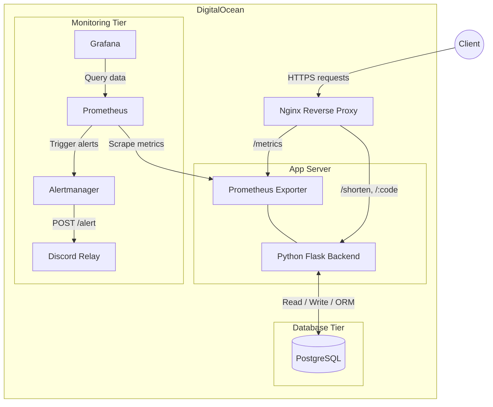

# Architecture Diagram

This document delineates the system architecture, detailing the request lifecycle, the technology stack, and our comprehensive monitoring setup deployed on DigitalOcean.

## System Architecture

## Request Flow
1. **Client**: A user visits a short URL or submits a request to the API to generate a new short URL.
2. **Nginx Reverse Proxy**: Nginx on the Droplet receives HTTPS traffic and routes requests to Flask and observability services.
3. **App Server**: The Python Flask application processes the request.
    - If it's a `GET /r/:code`, it queries the database for the original URL and returns a `302 Redirect`.
   - If it's a `POST /shorten`, it generates a unique shortcode, commits it to PostgreSQL, and returns the short URL.
4. **PostgreSQL DB**: Stores User profiles, URL mappings, and Event analytics.

## Monitoring Stack
We ensure the application is highly observable and reliable via the following components:
- **Metrics Exporter**: The Flask App exposes runtime, request, and system metrics at the `GET /metrics` endpoint.
- **Prometheus**: A time-series database that continuously scrapes the `/metrics` endpoint to collect data.
- **Grafana**: A visualization dashboard that queries Prometheus to display graphs representing application health (e.g., latency, active connections, error rates).
- **Alertmanager**: Integrates with Prometheus to ping Webhooks (e.g., Discord) if critical system thresholds are exceeded.
- **Discord Relay**: Receives Alertmanager webhook payloads and forwards formatted alert messages to Discord using `DISCORD_WEBHOOK_URL`.
